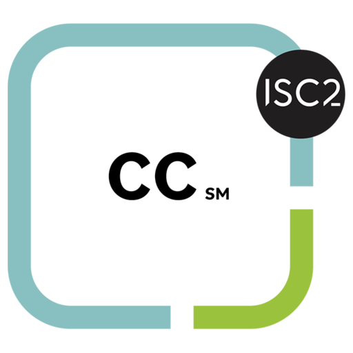

# Hi I'm Kiera Navarro!

[]()

I'm a 3rd year Math-CS student at UC San Diego. I'm fairly involved on student organizations on campus, I am an ...
- [X] Event Host for the Cyber Community in Association of Computing Machinery (ACM) 
- [X] Outreach/Events Coordinator for Girl Gains

My career goal is to become an Information Security Engineer and Analyst. I've been working as an InfoSec Engineer and Analyst student intern at Intel for about 1.5 years. My internship has helped me understand the daily operations of a security organization and how to work in an agile team. I have also earned the ISC<sup>2</sup> [Certified in Cybersecurity](https://www.isc2.org/certified-in-cybersecurity?filter=featured&searchRoot=A82B5ABE5FF04271998AE8A4B5D7DEFD) certification, and I'm currently studying for the CompTIA [Security+](https://www.comptia.org/certifications/security) certification. 

<html>
  <p>
   <a href="https://acmucsd.com/">
    
   </a>
   <a href="https://www.instagram.com/girlgainsucsd/">
    
   </a>
   <a href="https://www.intel.com/content/www/us/en/homepage.html">
    
   </a>
   <a href="https://www.isc2.org/certified-in-cybersecurity?filter=featured&searchRoot=A82B5ABE5FF04271998AE8A4B5D7DEFD">
    
   </a>
   <a href="https://www.comptia.org/certifications/security">
    
   </a>
</p>
</html>

## My technical experience

* **Languages**: Java, Python, C, C++, Assembly, HTML, MATLAB, YAML, Splunk SPL
* **Tools**: Linux, UNIX, Visual Studio Code, Eclipse, Junit, Git, GitHub, BlueJ 

I'm comfortable using Markdown; I first learned markdown in CSE 12/15L and I continued using it to write out my notes for CSE 100 and other classes. I'm also experienced in HTML and I've used it in my internship. <br>
However, I had to relearn Git from when I took CSE 15L in my first year. I did so by creating a test branch (called `test-git`) and playing around with it:
> git branch test-git

I encountered some issues trying to delete my branch (locally and remotely), so I used several of these commands to delete the test branch (help from [here](https://www.git-tower.com/learn/git/faq/delete-remote-branch) and [here](https://stackoverflow.com/questions/2003505/how-do-i-delete-a-git-branch-locally-and-remotely))
```
git push -d origin test-git
git branch -D test-git
git push origin --delete test-git
git worktree prune
git fetch test-git --prune
```

## More from Me

This page was built on my `index.md` file [here](https://github.com/kieraliz/cse110/blob/main/index.md) and on my [GitHub repo](https://github.com/kieraliz/cse110)

See my personal [GitHub profile](https://github.com/kieraliz) for more
